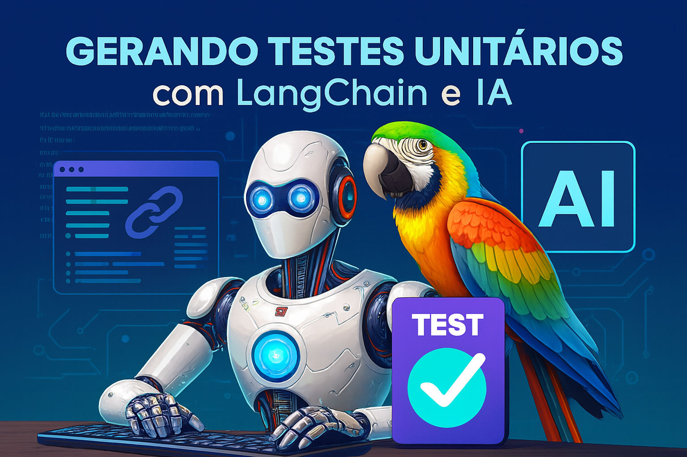

# 🧪 LangChain TestGen com Ollama

## 🤖 Geração Automática de Testes Unitários com IA Local

---

## 🏅 Badges

- 📦 Tamanho do repositório:  
  

- 📄 Licença do projeto:  
  

---

## 📋 Índice / Table of Contents

- [📖 Descrição / Description](#📖-descrição--description)   
- [⚙️ Funcionalidades / Features](#⚙️-funcionalidades--features)  
- [🚀 Execução / Execution](#🚀-execução--execution)  
- [🌐 Acesso / Access](#🌐-acesso--access)  
- [🧰 Tecnologias / Technologies](#🧰-tecnologias--technologies)  
- [👨‍💻 Desenvolvedor / Developer](#👨‍💻-desenvolvedor--developer)  
- [📜 Licença / License](#📜-licença--license)  
- [🏁 Conclusão / Conclusion](#🏁-conclusão--conclusion)

---

## 📖 Descrição / Description

**PT:**  
Este projeto foi desenvolvido como parte do desafio da DIO: *Gerando Testes Unitários com LangChain e Azure ChatGPT*.  
Embora o desafio mencione Azure ChatGPT, **optei por utilizar Ollama com LangChain para executar os modelos localmente**. Isso permite **maior controle, privacidade e independência de serviços externos**, mantendo todos os conceitos e funcionalidades exigidos no desafio.

O agente de IA recebe um arquivo Python como entrada e gera automaticamente um arquivo de testes unitários com `pytest`, contendo:

- `import pytest` na primeira linha  
- Funções `def test_*` para casos de sucesso e falha  
- Arquivos nomeados como `test_<nome>.py`

**EN:**  
This project was developed as part of the DIO challenge: *Generating Unit Tests with LangChain and Azure ChatGPT*.  
Although the challenge mentions Azure ChatGPT, **I chose to use Ollama with LangChain to run models locally**, allowing for **greater control, privacy, and independence from external services**, while maintaining all required concepts and functionalities.

The AI agent receives a Python file as input and automatically generates a `pytest` test file containing:

- `import pytest` at the top  
- `def test_*` functions for success and failure cases  
- Files named as `test_<name>.py`

---

## ⚙️ Funcionalidades / Features

| 🧩 Funcionalidade (PT)                          | 💡 Description (EN)                          |
|------------------------------------------------|----------------------------------------------|
| 📥 Entrada de código Python                    | 📥 Python code input                         |
| 🧠 Geração de testes com IA local (Ollama)     | 🧠 Test generation with local AI (Ollama)    |
| 🧪 Arquivos de teste com estrutura `pytest`    | 🧪 Test files structured for `pytest`        |
| 📂 Organização modular com `src/` e `tests/`   | 📂 Modular structure with `src/` and `tests/`|
| ⚙️ Automação com `.bat` e `Makefile`           | ⚙️ Automation via `.bat` and `Makefile`      |

---

## 🚀 Execução / Execution

**PT:**  
1. Clone o repositório  
2. Instale as dependências com `pip install -r requirements.txt`  
3. Configure o ambiente local com Ollama e LangChain  
4. Execute o agente com `python main.py --arquivo <caminho_do_arquivo.py>`  
5. Rode os testes com `pytest` ou `run_tests.bat`  
6. Use `gerar_testes.bat` ou `make gerar-testes` para automatizar

**EN:**  
1. Clone the repository  
2. Install dependencies with `pip install -r requirements.txt`  
3. Set up local environment with Ollama and LangChain  
4. Run the agent using `python main.py --arquivo <path_to_file.py>`  
5. Execute tests with `pytest` or `run_tests.bat`  
6. Use `gerar_testes.bat` or `make gerar-testes` for automation

---

## 🌐 Acesso / Access

- [🔗 Repositório GitHub / GitHub Repository](https://github.com/Rogerio5/langchain-testgen-ollama)

---

## 🧰 Tecnologias / Technologies

  
  
  
  

 

---

## 👨‍💻 Desenvolvedor / Developer

- [Rogerio](https://github.com/Rogerio5)

---

## 📜 Licença / License

Este projeto está sob licença MIT. Para mais detalhes, veja o arquivo `LICENSE`.  
This project is under the MIT license. For more details, see the `LICENSE` file.

---

## 🏁 Conclusão / Conclusion

**PT:**  
Este projeto demonstra como agentes de IA podem ser aplicados para acelerar o desenvolvimento de software, automatizando a geração de testes unitários com precisão e estrutura. A escolha por Ollama reforça o compromisso com soluções locais, seguras e escaláveis.

**EN:**  
This project demonstrates how AI agents can accelerate software development by automating unit test generation with precision and structure. The choice of Ollama reinforces a commitment to local, secure, and scalable solutions.
